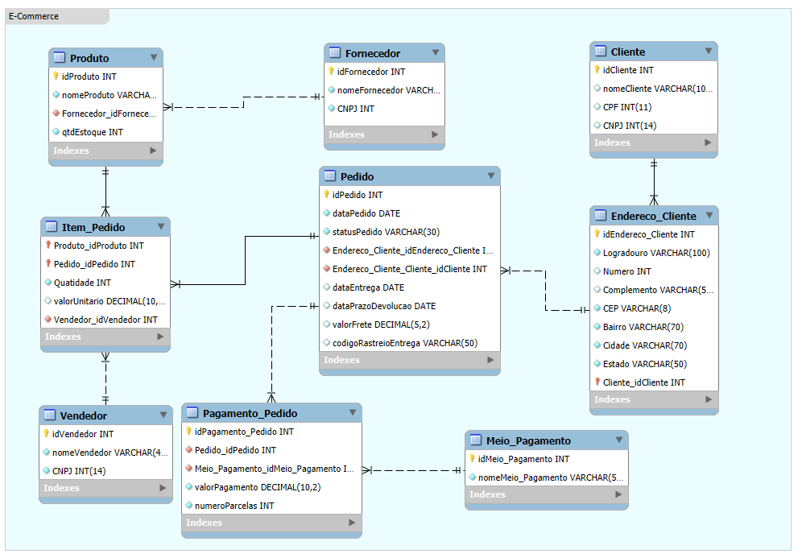

# BootCamp 🌿Suzano & DIO: Análise de Dados com Power BI 🎲 (*Desafio 01*)
### Desafio 01 - Projeto Conceitual de Banco de Dados – E-COMMERCE  
    
## 🎯Objetivo:
Realizar a **modelagem de dados** do projeto proposto de **E-Commerce**, conforme requisitos informados.  
O intuito é aplicar o conhecimento compartilhado até essa etapa do curso.  
Podendo utilizar uma das ferramentas demonstradas na aula: **DB Designer**, **Draw.io** e **MySQL Workbench**.  
    

    
## 🤓Apresentação do Desafio:
>Elaborar o Modelo Relacional do Projeto de E-Commerce, considerando que a proposta é a venda de produtos.  
>A venda dos produtos ocorrerá através de uma única plataforma online.  
>Abaixo temos o 📋 Levantamento de Requisitos descritos no desafio do Bootcamp da Suzano & DIO:
    

- 📋 1) Narrativa - Cliente
    - O cliente pode se cadastrar no site com seu CPF ou CNPJ.
    - O Endereço do cliente irá determinar o valor do frete.
    - Um cliente pode comprar mais de um pedido.
    - Este tem um período de carência para devolução do produto.
- 📋 2) Narrativa - Produto
    - Os produtos são vendidos por uma única plataforma online. Contudo, estes podem ter vendedores distintos (terceiros).
    - Cada produto possui um fornecedor.
    - Um ou mais produtos podem compor um pedido.
- 📋 3) Narrativa - Pedido
    - O pedidos são criados por clientes e possuem informações de compra, endereço e status da entrega.
    - Um produto ou mais compoem o pedido.
    - O pedido pode ser cancelado.
- 📋 4) Narrativa - Fornecedor & Estoque
    - Precisa de definição.
- 📋 5) Refinamento
    - Um cliente pode ser PJ ou PF, mas não pode ter as duas informações.
    - Pode ter cadastrado mais de uma forma de pagamento.
    - Entrega possui status e código de rastreio.

### Premissas e Considerações:

Esses requisitos precisam de refinamentos que consistiriam de algumas sessões de questionamentos para melhor entendimento e detalhamento. Sendo este um exemplo/exercício, iremos destacar algumas considerações como verdades que seria parte do resultado desse trabalho de refinamento.

- O período de carência será calculado conforme regra de negocio na aplicação, a base de dados disponibilizará um campo para registro da data limite da devolução. Esta reflete a data de entrega acrescida do número de dias deste calculo do prazo.

- No cadastro do Cliente deve constar apenas CPF ou CNPJ, não pode informar ambos ou deixar de informar.

- Chamaremos de Item Pedido a relação de cada produto, comprado em um pedido por um determinado cliente em determinado momento.

- Vendedores serão considerados em cada item pedido. Pois entendemos que os vendedores são os responsáveis pela exposição na plataforma online do Marketplace. Portanto, em cada seleção de produto que o cliente fizer, possuirá a respectiva informação do vendedor.

- O cancelamento do pedido será tratado na aplicação, na base será registrado apenas com o valor apropriado no Status do Pedido.

- O controle de estoque do Fornecedor será tratado na aplicação. A base de dados fornecerá um campo de Quantidade de Estoque por produto para persistir tal situação conforme ocorrência de movimentações do produto.

## 🤓Desafio Feito😎! Minha resolução🎉🎉🎉:
> 📋**Modelo Lógico**:  
> 

- Garantiremos a regra de informe apenas do CPF ou CNPJ do cliente com uma Check Constraint nesta tabela.

- Status do Pedido: Solicitado, Aguardando Aprovação, Confirmando Pagamento, Preparando Envio, Enviado p/ Transportadora, Entregue e Cancelado. Também será uma Check Constraint.

- Meio de pagamento: A aplicação irá controla o processo de forma de pagamentos, inclusive garantir que o somatório dos valores de todas os meios de pagamentos utilizados é igual ao valor Total do Pedido. A base de dados disponibilizará em sua estrutura uma tabela com as formas de pagamentos possíveis e outra para relacionar com Pedido, correspondendo as formas de pagamentos utilizadas para pagamento de determinado pedido.

- O código de rastreio da entrega será um campo no pedido.

> 📋**Modelo Físico**:  

```sql
-- MySQL Script generated by MySQL Workbench
-- Fri Nov 15 20:07:53 2024
-- Model: New Model    Version: 1.0
-- MySQL Workbench Forward Engineering

SET @OLD_UNIQUE_CHECKS=@@UNIQUE_CHECKS, UNIQUE_CHECKS=0;
SET @OLD_FOREIGN_KEY_CHECKS=@@FOREIGN_KEY_CHECKS, FOREIGN_KEY_CHECKS=0;
SET @OLD_SQL_MODE=@@SQL_MODE, SQL_MODE='ONLY_FULL_GROUP_BY,STRICT_TRANS_TABLES,NO_ZERO_IN_DATE,NO_ZERO_DATE,ERROR_FOR_DIVISION_BY_ZERO,NO_ENGINE_SUBSTITUTION';

-- -----------------------------------------------------
-- Schema ECommerce
-- -----------------------------------------------------

-- -----------------------------------------------------
-- Schema ECommerce
-- -----------------------------------------------------
CREATE SCHEMA IF NOT EXISTS `ECommerce` DEFAULT CHARACTER SET utf8 ;
USE `ECommerce` ;

-- -----------------------------------------------------
-- Table `ECommerce`.`Fornecedor`
-- -----------------------------------------------------
CREATE TABLE IF NOT EXISTS `ECommerce`.`Fornecedor` (
  `idFornecedor` INT NOT NULL AUTO_INCREMENT,
  `nomeFornecedor` VARCHAR(70) NOT NULL,
  `CNPJ` INT NOT NULL,
  PRIMARY KEY (`idFornecedor`),
  UNIQUE INDEX `CNPJ_UNIQUE` (`CNPJ` ASC) VISIBLE)
ENGINE = InnoDB;


-- -----------------------------------------------------
-- Table `ECommerce`.`Produto`
-- -----------------------------------------------------
CREATE TABLE IF NOT EXISTS `ECommerce`.`Produto` (
  `idProduto` INT NOT NULL AUTO_INCREMENT,
  `nomeProduto` VARCHAR(45) NOT NULL,
  `Fornecedor_idFornecedor` INT NOT NULL,
  `qtdEstoque` INT NOT NULL DEFAULT 0,
  PRIMARY KEY (`idProduto`),
  INDEX `fk_Produto_Fornecedor_idx` (`Fornecedor_idFornecedor` ASC) VISIBLE,
  CONSTRAINT `fk_Produto_Fornecedor`
    FOREIGN KEY (`Fornecedor_idFornecedor`)
    REFERENCES `ECommerce`.`Fornecedor` (`idFornecedor`)
    ON DELETE NO ACTION
    ON UPDATE NO ACTION)
ENGINE = InnoDB;


-- -----------------------------------------------------
-- Table `ECommerce`.`Cliente`
-- -----------------------------------------------------
CREATE TABLE IF NOT EXISTS `ECommerce`.`Cliente` (
  `idCliente` INT NOT NULL AUTO_INCREMENT,
  `nomeCliente` VARCHAR(100) NULL,
  `CPF` INT(11) NULL COMMENT 'CPF será obrigatório, caso CNPJ não seja informado.\nIsso será garantido por Check Constraint.',
  `CNPJ` INT(14) NULL COMMENT 'CNPJ será obrigatório, caso CPF não seja informado.\nIsso será garantido por Check Constraint.',
  PRIMARY KEY (`idCliente`),
  UNIQUE INDEX `CPF_UNIQUE` (`CPF` ASC) VISIBLE,
  UNIQUE INDEX `CNPJ_UNIQUE` (`CNPJ` ASC) VISIBLE,
  CONSTRAINT `chk_CPF_CNPJ`
    CHECK (
      (CPF IS NOT NULL AND CNPJ IS NULL) OR 
      (CPF IS NULL AND CNPJ IS NOT NULL)
    ))
ENGINE = InnoDB;


-- -----------------------------------------------------
-- Table `ECommerce`.`Endereco_Cliente`
-- -----------------------------------------------------
CREATE TABLE IF NOT EXISTS `ECommerce`.`Endereco_Cliente` (
  `idEndereco_Cliente` INT NOT NULL AUTO_INCREMENT,
  `Logradouro` VARCHAR(100) NOT NULL,
  `Numero` INT NULL,
  `Complemento` VARCHAR(50) NULL,
  `CEP` VARCHAR(8) NOT NULL,
  `Bairro` VARCHAR(70) NOT NULL,
  `Cidade` VARCHAR(70) NOT NULL,
  `Estado` VARCHAR(50) NOT NULL,
  `Cliente_idCliente` INT NOT NULL,
  PRIMARY KEY (`idEndereco_Cliente`, `Cliente_idCliente`),
  INDEX `fk_Endereco_Cliente_Cliente1_idx` (`Cliente_idCliente` ASC) VISIBLE,
  CONSTRAINT `fk_Endereco_Cliente_Cliente1`
    FOREIGN KEY (`Cliente_idCliente`)
    REFERENCES `ECommerce`.`Cliente` (`idCliente`)
    ON DELETE NO ACTION
    ON UPDATE NO ACTION)
ENGINE = InnoDB;


-- -----------------------------------------------------
-- Table `ECommerce`.`Pedido`
-- -----------------------------------------------------
CREATE TABLE IF NOT EXISTS `ECommerce`.`Pedido` (
  `idPedido` INT NOT NULL AUTO_INCREMENT,
  `dataPedido` DATE NOT NULL,
  `statusPedido` VARCHAR(30) NOT NULL COMMENT 'O status do pedido posicionará toda situação do mesmo até finalização da entrega.',
  `Endereco_Cliente_idEndereco_Cliente` INT NOT NULL,
  `Endereco_Cliente_Cliente_idCliente` INT NOT NULL,
  `dataEntrega` DATE NULL,
  `dataPrazoDevolucao` DATE NULL COMMENT 'O prazo de devolução é uma regra de negócio que considera vários fatores. Portanto, o sistema fará o calculo do prazo e registrará esse dado neste campo do pedido.',
  `valorFrete` DECIMAL(5,2) NULL COMMENT 'O valor do frete será calculado pelo sistema e registrado neste campo. Esse calculo considera o endereço de entrega apontado no pedido informado pelo cliente e registrado no pedido.',
  `codigoRastreioEntrega` VARCHAR(50) NULL,
  PRIMARY KEY (`idPedido`),
  INDEX `fk_Pedido_Endereco_Cliente1_idx` (`Endereco_Cliente_idEndereco_Cliente` ASC, `Endereco_Cliente_Cliente_idCliente` ASC) VISIBLE,
  CONSTRAINT `fk_Pedido_Endereco_Cliente1`
    FOREIGN KEY (`Endereco_Cliente_idEndereco_Cliente` , `Endereco_Cliente_Cliente_idCliente`)
    REFERENCES `ECommerce`.`Endereco_Cliente` (`idEndereco_Cliente` , `Cliente_idCliente`)
    ON DELETE NO ACTION
    ON UPDATE NO ACTION,
  CONSTRAINT chk_statusPedido
    CHECK (statusPedido IN ('Solicitado', 'Aguardando Aprovação', 'Confirmando Pagamento', 'Preparando Envio', 'Enviado p/ Transportadora', 'Entregue', 'Cancelado'))
	)
ENGINE = InnoDB;


-- -----------------------------------------------------
-- Table `ECommerce`.`Vendedor`
-- -----------------------------------------------------
CREATE TABLE IF NOT EXISTS `ECommerce`.`Vendedor` (
  `idVendedor` INT NOT NULL AUTO_INCREMENT,
  `nomeVendedor` VARCHAR(45) NOT NULL,
  `CNPJ` INT(14) NOT NULL,
  PRIMARY KEY (`idVendedor`),
  UNIQUE INDEX `CNPJ_UNIQUE` (`CNPJ` ASC) VISIBLE)
ENGINE = InnoDB;


-- -----------------------------------------------------
-- Table `ECommerce`.`Item_Pedido`
-- -----------------------------------------------------
CREATE TABLE IF NOT EXISTS `ECommerce`.`Item_Pedido` (
  `Produto_idProduto` INT NOT NULL,
  `Pedido_idPedido` INT NOT NULL,
  `Quatidade` INT NOT NULL,
  `valorUnitario` DECIMAL(10,2) NULL,
  `Vendedor_idVendedor` INT NOT NULL,
  PRIMARY KEY (`Produto_idProduto`, `Pedido_idPedido`),
  INDEX `fk_Produto_has_Pedido_Pedido1_idx` (`Pedido_idPedido` ASC) VISIBLE,
  INDEX `fk_Produto_has_Pedido_Produto1_idx` (`Produto_idProduto` ASC) VISIBLE,
  INDEX `fk_Item_Pedido_Vendedor1_idx` (`Vendedor_idVendedor` ASC) VISIBLE,
  CONSTRAINT `fk_Produto_has_Pedido_Produto1`
    FOREIGN KEY (`Produto_idProduto`)
    REFERENCES `ECommerce`.`Produto` (`idProduto`)
    ON DELETE NO ACTION
    ON UPDATE NO ACTION,
  CONSTRAINT `fk_Produto_has_Pedido_Pedido1`
    FOREIGN KEY (`Pedido_idPedido`)
    REFERENCES `ECommerce`.`Pedido` (`idPedido`)
    ON DELETE NO ACTION
    ON UPDATE NO ACTION,
  CONSTRAINT `fk_Item_Pedido_Vendedor1`
    FOREIGN KEY (`Vendedor_idVendedor`)
    REFERENCES `ECommerce`.`Vendedor` (`idVendedor`)
    ON DELETE NO ACTION
    ON UPDATE NO ACTION)
ENGINE = InnoDB;


-- -----------------------------------------------------
-- Table `ECommerce`.`Meio_Pagamento`
-- -----------------------------------------------------
CREATE TABLE IF NOT EXISTS `ECommerce`.`Meio_Pagamento` (
  `idMeio_Pagamento` INT NOT NULL AUTO_INCREMENT,
  `nomeMeio_Pagamento` VARCHAR(50) NOT NULL,
  PRIMARY KEY (`idMeio_Pagamento`),
  UNIQUE INDEX `nomeMeio_Pagamento_UNIQUE` (`nomeMeio_Pagamento` ASC) VISIBLE)
ENGINE = InnoDB;


-- -----------------------------------------------------
-- Table `ECommerce`.`Pagamento_Pedido`
-- -----------------------------------------------------
CREATE TABLE IF NOT EXISTS `ECommerce`.`Pagamento_Pedido` (
  `idPagamento_Pedido` INT NOT NULL AUTO_INCREMENT,
  `Pedido_idPedido` INT NOT NULL,
  `Meio_Pagamento_idMeio_Pagamento` INT NOT NULL,
  `valorPagamento` DECIMAL(10,2) NOT NULL COMMENT 'A validação da soma de todos as formas de pagamento com o total do pedido deverá ser validado pela aplicação.',
  `numeroParcelas` INT NOT NULL,
  PRIMARY KEY (`idPagamento_Pedido`),
  INDEX `fk_Meio_Pagamento_has_Pedido_Pedido1_idx` (`Pedido_idPedido` ASC) VISIBLE,
  INDEX `fk_Meio_Pagamento_has_Pedido_Meio_Pagamento1_idx` (`Meio_Pagamento_idMeio_Pagamento` ASC) VISIBLE,
  CONSTRAINT `fk_Meio_Pagamento_has_Pedido_Meio_Pagamento1`
    FOREIGN KEY (`Meio_Pagamento_idMeio_Pagamento`)
    REFERENCES `ECommerce`.`Meio_Pagamento` (`idMeio_Pagamento`)
    ON DELETE NO ACTION
    ON UPDATE NO ACTION,
  CONSTRAINT `fk_Meio_Pagamento_has_Pedido_Pedido1`
    FOREIGN KEY (`Pedido_idPedido`)
    REFERENCES `ECommerce`.`Pedido` (`idPedido`)
    ON DELETE NO ACTION
    ON UPDATE NO ACTION)
ENGINE = InnoDB;


SET SQL_MODE=@OLD_SQL_MODE;
SET FOREIGN_KEY_CHECKS=@OLD_FOREIGN_KEY_CHECKS;
SET UNIQUE_CHECKS=@OLD_UNIQUE_CHECKS;

```

❗👏🎉Fim do Desafio 01