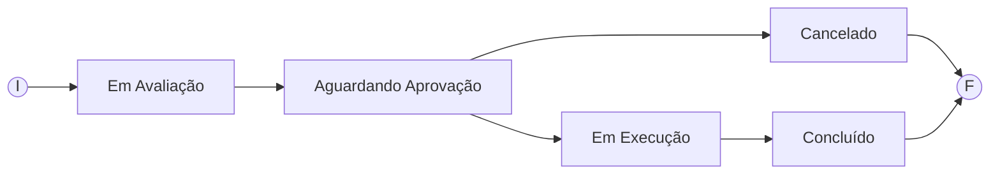

# BootCamp 🌿Suzano & DIO: Análise de Dados com Power BI 🎲 (*Desafio 02*)
### Desafio 02 - Projeto Conceitual de Ordem de Serviço em uma Oficina Mecânica 👨‍🔧🧰🚗
    
## 🎯Objetivo:
Realizar a **modelagem de dados** do projeto proposto de **Ordem de Serviço** para **Oficina Mecânica**, conforme requisitos informados.  
O intuito é aplicar o conhecimento compartilhado até essa etapa do curso.  
Podendo utilizar uma das ferramentas demonstradas na aula: **DB Designer**, **Draw.io** e **MySQL Workbench**.  


    
## 🤓Apresentação do Desafio:
>Elaborar o Modelo Relacional do Projeto de Ordem de Serviço para Oficina Mecânica.  
>A sigla OS corresponde ao termo "Ordem de Serviço".  
>Abaixo temos o 📋 Levantamento de Requisitos descritos no desafio do Bootcamp da Suzano & DIO:
    

- 📋 Narrativa:
    - Sistema de controle e gerenciamento de execução de ordens de serviço em uma oficina mecânica.
    - Clientes levam veículos à oficina mecânica para serem consertados ou para passarem por revisões periódicas.
    - Cada veículo é designado a uma equipe de mecânicos que:
        - Identifica os serviços a serem executados
        - E preenchem uma OS com data de entrega.
    - A partir da OS, calcula-se o valor de cada serviço, consultando-se uma tabela de referência de mão-de-obra.
    - O valor de cada peça também irá compor a OS.
    - O cliente autoriza a execução dos serviços.
    - A mesma equipe avalia e executa os serviços.
    - Os mecânicos possuem código, nome, endereço e especialidade.
    - Cada OS possui: n°, data de emissão, um valor, status e uma data para conclusão dos trabalhos.
    - Uma OS pode ser composta por vários serviços e um mesmo serviço pode estar contido em mais de uma OS.
    - Uma OS pode ter vários tipos de peça e uma peça pode estar presente em mais de uma OS.

### Premissas e Considerações:

Abaixo destaco algumas considerações sobre o entendimento dos requisitos para seguir com o desenho do projeto.

- Siglas utilizadas neste projeto:

    |Sigla     | Descrição      |
    |-----------|----------------|
    | OS| Ordem de Serviço |
    | MO| Mão-de-Obra |

- O Tipo de Serviço da OS, determinará se a OS corresponde a um Conserto ou Revisão Periódica.  
Haverá uma Check Constraint para garantir apenas estes valores como validos bo campo: CONSERTO e REVISAO.

- A tabela de Serviço será a base de um catalogo de serviços oferecidos pela Oficina, inclusive contemplará o valor de cada serviço, abrangendo desta forma a tabela de referência de mão-de-obra.

- Na OS, estou considerando que a Data de Entrega e a Data de Conclusão dos Trabalhos correspondem a mesma informação.
E ela será informada na OS pela Equipe de mecânicos ao fim da avaliação de mecânica de serviços e peças.

- A equipe de mecânicos também registrará as associções que estabelecerão quais serviços e/ou peças deverão conter na OS durante avaliação do veículo.

- O valor do serviço e o valor da peça será consultado na respectiva tabela para ser registrado durante associação de cada Item da OS.

- O CPF ou CNPJ serão controlados e validado pela aplicação. A base garantirá apenas a unicidade do valor na tabela de clientes.

- A autorização ou não do cliente para seguir com a OS, implicará na mudança de status da OS.

 

## 🤓Desafio Feito😎! Minha resolução🎉🎉🎉:
> 📋**Modelo Lógico**:  
> 

- O Item_OS irá relacionar cada Serviço ou Peça associado a OS.  
Cada registro do Item_OS deverá conter o relacionamento apenas com Serviço ou apenas com Peça,  
nunca com ambos preenchidos ou ambos sem preenchimento. Isso será garantido com uma Check Constraint.  
Demais regras de negócio será contralado pela aplicação, tal como se há ou não necessidade de haver ao menos 1 serviço associado a OS.

- O relacionamento entre cliente e veiculo será apenas para identificar o dono do veículo e facilitar pesquisa de identificação.

- O cliente informado na OS não precisa ser o proprietário do veículo, qualquer pessoa cadastrada como cliente pode solicitar uma OS.

- O ideal para alguns campos como Fabricante e Modelo na tabela de Veiculo e Fabricante na tabela de Peças é que fossem provenientes de tabelas que os agrupassem. Para o exercício deste desafio não farei isso, seguirei como um campo texto solto para não alongar muito.

- A designação do veículo à equipe de mecânicos será relacionada na OS.

- Os status da OS serão:

Onde:  
**Em Avaliação** ⇒ Processo aguardando e/ou em avaliação pela equipe de mecânicos designados para o veículo.  
**Aguardando Aprovação** ⇒ Avaliação e orçamento concluídos, aguardando aprovação do cliente.  
**Cancelado** ⇒ Situação final, caso o cliente não aprove a execução da OS.  
**Em Execução** ⇒ Equipe de mecânicos realizando a execução dos serviços e/ou reposição de peças contidos na OS.  
**Concluído** ⇒ Término da execução da OS e veículo liberado para o cliente.  


> 📋**Modelo Físico**:  

```sql
-- MySQL Script generated by MySQL Workbench
-- Sun Nov 17 15:40:00 2024
-- Model: New Model    Version: 1.0
-- MySQL Workbench Forward Engineering

SET @OLD_UNIQUE_CHECKS=@@UNIQUE_CHECKS, UNIQUE_CHECKS=0;
SET @OLD_FOREIGN_KEY_CHECKS=@@FOREIGN_KEY_CHECKS, FOREIGN_KEY_CHECKS=0;
SET @OLD_SQL_MODE=@@SQL_MODE, SQL_MODE='ONLY_FULL_GROUP_BY,STRICT_TRANS_TABLES,NO_ZERO_IN_DATE,NO_ZERO_DATE,ERROR_FOR_DIVISION_BY_ZERO,NO_ENGINE_SUBSTITUTION';

-- -----------------------------------------------------
-- Schema Oficina
-- -----------------------------------------------------
-- Projeto conceitual de Ordem de Serviço para Oficina Mecânica.
-- Desafio do Bootcamp de Analise de Dados com Power BI da DIO & Suzano.

-- -----------------------------------------------------
-- Schema Oficina
--
-- Projeto conceitual de Ordem de Serviço para Oficina Mecânica.
-- Desafio do Bootcamp de Analise de Dados com Power BI da DIO & Suzano.
-- -----------------------------------------------------
CREATE SCHEMA IF NOT EXISTS `Oficina` DEFAULT CHARACTER SET utf8 COLLATE utf8_bin ;
USE `Oficina` ;

-- -----------------------------------------------------
-- Table `Oficina`.`Especialidade`
-- -----------------------------------------------------
CREATE TABLE IF NOT EXISTS `Oficina`.`Especialidade` (
  `idEspecialidade` INT NOT NULL AUTO_INCREMENT,
  `Especialidade` VARCHAR(40) NOT NULL,
  PRIMARY KEY (`idEspecialidade`))
ENGINE = InnoDB;


-- -----------------------------------------------------
-- Table `Oficina`.`Equipe`
-- -----------------------------------------------------
CREATE TABLE IF NOT EXISTS `Oficina`.`Equipe` (
  `idEquipe` INT NOT NULL AUTO_INCREMENT,
  `nomeEquipe` VARCHAR(50) NOT NULL,
  PRIMARY KEY (`idEquipe`),
  UNIQUE INDEX `nomeEquipe_UNIQUE` (`nomeEquipe` ASC) VISIBLE)
ENGINE = InnoDB;


-- -----------------------------------------------------
-- Table `Oficina`.`Mecanico`
-- -----------------------------------------------------
CREATE TABLE IF NOT EXISTS `Oficina`.`Mecanico` (
  `Codigo` INT NOT NULL AUTO_INCREMENT,
  `Nome` VARCHAR(70) NOT NULL,
  `endLogradouro` VARCHAR(50) NOT NULL,
  `endNumero` INT NULL,
  `endBairro` VARCHAR(30) NULL,
  `endCidade` VARCHAR(30) NULL,
  `endUF` VARCHAR(2) NULL,
  `Especialidade_idEspecialidade` INT NOT NULL,
  `Equipe_idEquipe` INT NOT NULL,
  PRIMARY KEY (`Codigo`),
  INDEX `fk_Mecanico_Especialidade_idx` (`Especialidade_idEspecialidade` ASC) VISIBLE,
  INDEX `fk_Mecanico_Equipe1_idx` (`Equipe_idEquipe` ASC) VISIBLE,
  CONSTRAINT `fk_Mecanico_Especialidade`
    FOREIGN KEY (`Especialidade_idEspecialidade`)
    REFERENCES `Oficina`.`Especialidade` (`idEspecialidade`)
    ON DELETE NO ACTION
    ON UPDATE NO ACTION,
  CONSTRAINT `fk_Mecanico_Equipe1`
    FOREIGN KEY (`Equipe_idEquipe`)
    REFERENCES `Oficina`.`Equipe` (`idEquipe`)
    ON DELETE NO ACTION
    ON UPDATE NO ACTION)
ENGINE = InnoDB;


-- -----------------------------------------------------
-- Table `Oficina`.`Cliente`
-- -----------------------------------------------------
CREATE TABLE IF NOT EXISTS `Oficina`.`Cliente` (
  `idCliente` INT NOT NULL AUTO_INCREMENT,
  `nomeCliente` VARCHAR(70) NOT NULL,
  `CPF_CNPJ` VARCHAR(20) NOT NULL,
  PRIMARY KEY (`idCliente`),
  UNIQUE INDEX `CPF_CNPJ_UNIQUE` (`CPF_CNPJ` ASC) VISIBLE)
ENGINE = InnoDB;


-- -----------------------------------------------------
-- Table `Oficina`.`Veiculo`
-- -----------------------------------------------------
CREATE TABLE IF NOT EXISTS `Oficina`.`Veiculo` (
  `idVeiculo` INT NOT NULL AUTO_INCREMENT,
  `placaVeiculo` VARCHAR(10) NOT NULL,
  `fabricanteVeiculo` VARCHAR(50) NOT NULL,
  `modeloVeiculo` VARCHAR(50) NULL,
  `anoModeloVeiculo` INT NULL,
  `anoFabrilVeiculo` INT NULL,
  `Cliente_idCliente` INT NOT NULL,
  PRIMARY KEY (`idVeiculo`),
  UNIQUE INDEX `placaVeiculo_UNIQUE` (`placaVeiculo` ASC) VISIBLE,
  INDEX `fk_Veiculo_Cliente1_idx` (`Cliente_idCliente` ASC) VISIBLE,
  CONSTRAINT `fk_Veiculo_Cliente1`
    FOREIGN KEY (`Cliente_idCliente`)
    REFERENCES `Oficina`.`Cliente` (`idCliente`)
    ON DELETE NO ACTION
    ON UPDATE NO ACTION)
ENGINE = InnoDB;


-- -----------------------------------------------------
-- Table `Oficina`.`OS`
-- -----------------------------------------------------
CREATE TABLE IF NOT EXISTS `Oficina`.`OS` (
  `idOS` INT NOT NULL AUTO_INCREMENT,
  `tipoOS` VARCHAR(20) NOT NULL,
  `dataEmissaoOS` DATE NOT NULL,
  `statusOS` VARCHAR(30) NOT NULL,
  `valorOS` DECIMAL(10,2) NULL,
  `dataEntregaOS` DATE NULL,
  `Veiculo_idVeiculo` INT NOT NULL,
  `Cliente_idCliente` INT NOT NULL,
  `Equipe_idEquipe` INT NOT NULL,
  PRIMARY KEY (`idOS`),
  INDEX `fk_OS_Veiculo1_idx` (`Veiculo_idVeiculo` ASC) VISIBLE,
  INDEX `fk_OS_Cliente1_idx` (`Cliente_idCliente` ASC) VISIBLE,
  INDEX `fk_OS_Equipe1_idx` (`Equipe_idEquipe` ASC) VISIBLE,
  CONSTRAINT `fk_OS_Veiculo1`
    FOREIGN KEY (`Veiculo_idVeiculo`)
    REFERENCES `Oficina`.`Veiculo` (`idVeiculo`)
    ON DELETE NO ACTION
    ON UPDATE NO ACTION,
  CONSTRAINT `fk_OS_Cliente1`
    FOREIGN KEY (`Cliente_idCliente`)
    REFERENCES `Oficina`.`Cliente` (`idCliente`)
    ON DELETE NO ACTION
    ON UPDATE NO ACTION,
  CONSTRAINT `fk_OS_Equipe1`
    FOREIGN KEY (`Equipe_idEquipe`)
    REFERENCES `Oficina`.`Equipe` (`idEquipe`)
    ON DELETE NO ACTION
    ON UPDATE NO ACTION,
  CONSTRAINT `chk_tipoOS1`
    CHECK (tipoOS in ('CONSERTO', 'REVISAO'))
	)
ENGINE = InnoDB;


-- -----------------------------------------------------
-- Table `Oficina`.`Servico`
-- -----------------------------------------------------
CREATE TABLE IF NOT EXISTS `Oficina`.`Servico` (
  `idServico` INT NOT NULL AUTO_INCREMENT,
  `nomeServico` VARCHAR(50) NOT NULL,
  `valorServico` DECIMAL(7,2) NOT NULL,
  PRIMARY KEY (`idServico`),
  UNIQUE INDEX `nomeServico_UNIQUE` (`nomeServico` ASC) VISIBLE)
ENGINE = InnoDB;


-- -----------------------------------------------------
-- Table `Oficina`.`Peca`
-- -----------------------------------------------------
CREATE TABLE IF NOT EXISTS `Oficina`.`Peca` (
  `idPeca` INT NOT NULL AUTO_INCREMENT,
  `nomePeca` VARCHAR(50) NOT NULL,
  `fabricantePeca` VARCHAR(45) NULL,
  `valorPeca` DECIMAL(7,2) NOT NULL,
  PRIMARY KEY (`idPeca`))
ENGINE = InnoDB;


-- -----------------------------------------------------
-- Table `Oficina`.`Item_OS`
-- -----------------------------------------------------
CREATE TABLE IF NOT EXISTS `Oficina`.`Item_OS` (
  `idItem_OS` INT NOT NULL AUTO_INCREMENT,
  `OS_idOS` INT NOT NULL,
  `Servico_idServico` INT NULL,
  `Peca_idPeca` INT NULL,
  `qtdItem_OS` INT NOT NULL DEFAULT 1,
  `valorUnitarioItem_OS` DECIMAL(7,2) NULL,
  INDEX `fk_Item_OS_Servico1_idx` (`Servico_idServico` ASC) VISIBLE,
  INDEX `fk_Item_OS_Peca1_idx` (`Peca_idPeca` ASC) VISIBLE,
  PRIMARY KEY (`idItem_OS`),
  UNIQUE INDEX `UK_idOS_Peca_Serv` (`OS_idOS` ASC, `Servico_idServico` ASC, `Peca_idPeca` ASC) VISIBLE,
  CONSTRAINT `fk_Item_OS_OS1`
    FOREIGN KEY (`OS_idOS`)
    REFERENCES `Oficina`.`OS` (`idOS`)
    ON DELETE NO ACTION
    ON UPDATE NO ACTION,
  CONSTRAINT `fk_Item_OS_Servico1`
    FOREIGN KEY (`Servico_idServico`)
    REFERENCES `Oficina`.`Servico` (`idServico`)
    ON DELETE NO ACTION
    ON UPDATE NO ACTION,
  CONSTRAINT `fk_Item_OS_Peca1`
    FOREIGN KEY (`Peca_idPeca`)
    REFERENCES `Oficina`.`Peca` (`idPeca`)
    ON DELETE NO ACTION
    ON UPDATE NO ACTION,
  CONSTRAINT `chk_Servico_xor_Peca`
    CHECK (
      (Servico_idServico IS NOT NULL AND Peca_idPeca IS NULL) OR 
      (Servico_idServico IS NULL AND Peca_idPeca IS NOT NULL)
    ))
ENGINE = InnoDB;


SET SQL_MODE=@OLD_SQL_MODE;
SET FOREIGN_KEY_CHECKS=@OLD_FOREIGN_KEY_CHECKS;
SET UNIQUE_CHECKS=@OLD_UNIQUE_CHECKS;

```

❗👏🎉Fim do Desafio 02