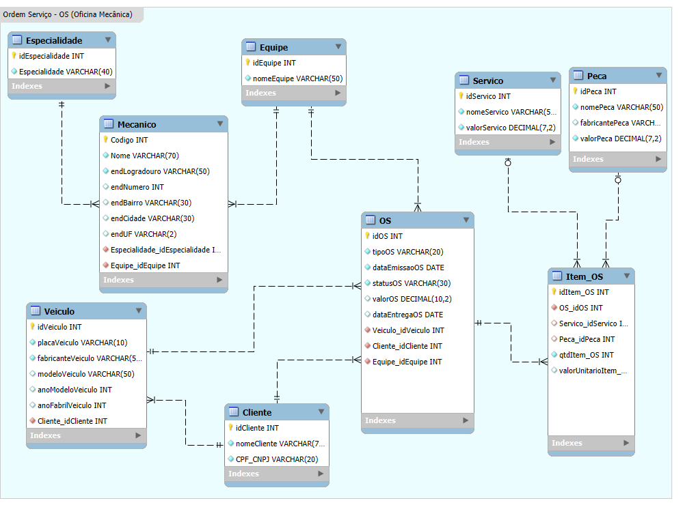
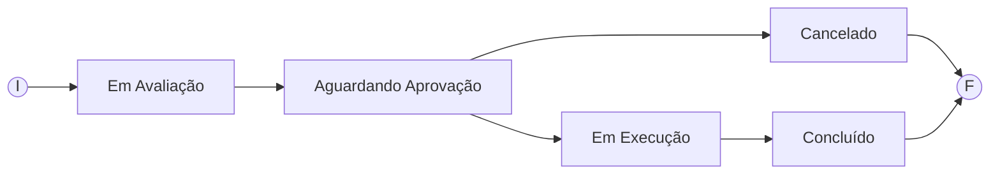

# BootCamp 🌿Suzano & DIO: Análise de Dados com Power BI 🎲 (*Desafio 04*)
### Desafio 04 - Projeto Lógico de Banco de Dados – Oficina OS  
    
## 🎯Objetivo:
Realizar a **modelagem de dados** do projeto proposto de **Oficina**, conforme descrição na **Apresentação do Desafio**.  
O intuito é aplicar o conhecimento compartilhado até essa etapa do curso.  
A ferramenta a ser utilizada será: **MySQL Workbench**.  
OBS: O ponto de partida será o meu modelo conceitual, gerado no Desafio 02.  
[Desafio 02 - Projeto Conceitual de Ordem de Serviço em uma Oficina Mecânica](aREADME_Desafio_Suzano_02_OrdemServicoOficina_Esquema_Conceitual.md)  
    

    
## 🤓Apresentação do Desafio:
>### Descrição do Desafio
>Para este cenário, utilize seu esquema conceitual, criado no desafio do módulo de modelagem de BD com modelo ER,  
>para criar o esquema lógico para o contexto de uma oficina.  
>Neste desafio, você definirá todas as etapas. Desde o esquema até a implementação do banco de dados.  
>Sendo assim, neste projeto você será o protagonista.  
>Tenha os mesmos cuidados, apontados no desafio anterior, ao modelar o esquema utilizando o modelo relacional.  
>
>Após a criação do esquema lógico, realize a criação do Script SQL para criação do esquema do banco de dados.  
>Posteriormente, realize a persistência de dados para realização de testes.  
>Especifique ainda queries mais complexas dos que apresentadas durante a explicação do desafio.  
>Sendo assim, crie queries SQL com as cláusulas abaixo:
    

- 📋 1) Recuperações simples com SELECT Statement
- 📋 2) Filtros com WHERE Statement
- 📋 3) Crie expressões para gerar atributos derivados
- 📋 4) Defina ordenações dos dados com ORDER BY
- 📋 5) Condições de filtros aos grupos – HAVING Statement
- 📋 6) Crie junções entre tabelas para fornecer uma perspectiva mais complexa dos dados
    
>### Diretrizes
>- Não há um mínimo de queries a serem realizadas;  
>- Os tópicos supracitados devem estar presentes nas queries;  
>- Elabore perguntas que podem ser respondidas pelas consultas;  
>- As cláusulas podem estar presentes em mais de uma query;  


### Premissas e Considerações:

Maiores detalhes podem ser consultados no mesmo item da Solução do Desafio 2:  
[Desafio 2 - Projeto Conceitual de Ordem de Serviço em uma Oficina Mecânica](aREADME_Desafio_Suzano_02_OrdemServicoOficina_Esquema_Conceitual_Projeto_Conceitual.md)  


## 🤓Desafio Feito😎! Minha resolução🎉🎉🎉:
> ## 📋**Modelo Lógico**:  
> 

- O Item_OS irá relacionar cada Serviço ou Peça associado a OS.  
Cada registro do Item_OS deverá conter o relacionamento apenas com Serviço ou apenas com Peça,  
nunca com ambos preenchidos ou ambos sem preenchimento. Isso será garantido com uma Check Constraint.  
Demais regras de negócio será contralado pela aplicação, tal como se há ou não necessidade de haver ao menos 1 serviço associado a OS.

- O relacionamento entre cliente e veiculo será apenas para identificar o dono do veículo e facilitar pesquisa de identificação.

- O cliente informado na OS não precisa ser o proprietário do veículo, qualquer pessoa cadastrada como cliente pode solicitar uma OS.

- O ideal para alguns campos como Fabricante e Modelo na tabela de Veiculo e Fabricante na tabela de Peças é que fossem provenientes de tabelas que os agrupassem. Para o exercício deste desafio não farei isso, seguirei como um campo texto solto para não alongar muito.

- A designação do veículo à equipe de mecânicos será relacionada na OS.

- Os status da OS serão:

Onde:  
**Em Avaliação** ⇒ Processo aguardando e/ou em avaliação pela equipe de mecânicos designados para o veículo.  
**Aguardando Aprovação** ⇒ Avaliação e orçamento concluídos, aguardando aprovação do cliente.  
**Cancelado** ⇒ Situação final, caso o cliente não aprove a execução da OS.  
**Em Execução** ⇒ Equipe de mecânicos realizando a execução dos serviços e/ou reposição de peças contidos na OS.  
**Concluído** ⇒ Término da execução da OS e veículo liberado para o cliente.  


> ## 📋**Modelo Físico** (Link ⇒ [Script_Geracao_Tabelas_BD_Oficina_OS.sql](./scripts/Script_MySQL_Schema_OrdemServicoOficinaOS_FromDiagram.sql)):  


> ## 📋**Persistindo os dados para testes: **:  
```sql
-- Acessando o Schema oficina
use oficina;

-- Persistindo dados de Especialidade
desc especialidade;
INSERT INTO especialidade (Especialidade) VALUES
("Eletricista"),
("Mecânico Geral"),
("Funileiro"),
("Pintor Automotivo");
select * from especialidade;

-- Persistindo dados de Equipe
desc equipe;
INSERT INTO equipe (nomeEquipe) VALUES
("Equipe Alfa"),
("Equipe Beta"),
("Equipe Gama");
select * from equipe;

-- Persistindo dados de Mecanico
desc mecanico;
INSERT INTO mecanico (Nome, endLogradouro, endNumero, endBairro, endCidade, endUF, Especialidade_idEspecialidade, Equipe_idEquipe) VALUES
("Carlos Silva", "Rua A", 123, "Centro", "São Paulo", "SP", 1, 1),
("João Souza", "Rua B", 456, "Jardim", "São Paulo", "SP", 2, 2),
("Ana Paula", "Av. Principal", 789, "Vila Nova", "Rio de Janeiro", "RJ", 3, 3),
("Roberto Lima", "Rua das Flores", 321, "Centro", "Curitiba", "PR", 4, 1),
("Fernanda Rodrigues", "Rua do Sol", 150, "Bela Vista", "Salvador", "BA", 2, 2),
("Ricardo Mendes", "Av. Brasil", 980, "Centro", "Belo Horizonte", "MG", 1, 3),
("Patrícia Almeida", "Rua da Paz", 222, "Boa Viagem", "Recife", "PE", 3, 1),
("Bruno Martins", "Rua Verde", 333, "Jardim América", "São Paulo", "SP", 4, 2),
("Luiza Carvalho", "Av. Central", 888, "Zona Sul", "Rio de Janeiro", "RJ", 1, 3),
("Gustavo Freitas", "Rua das Palmeiras", 555, "Centro", "Fortaleza", "CE", 2, 1);
select * from mecanico;

-- Persistindo dados de Cliente
desc cliente;
INSERT INTO cliente (nomeCliente, CPF_CNPJ) VALUES
("Maria Pereira", "123.456.789-00"),
("José Santos", "987.654.321-00"),
("Fernanda Costa", "123.987.654-00"),
("Luiz Henrique", "789.123.456-00");
select * from cliente;

-- Persistindo dados de Veiculo
desc veiculo;
INSERT INTO veiculo (placaVeiculo, fabricanteVeiculo, modeloVeiculo, anoModeloVeiculo, anoFabrilVeiculo, Cliente_idCliente) VALUES
("ABC-1234", "Ford", "Fiesta", 2018, 2017, 1),
("XYZ-5678", "Chevrolet", "Onix", 2020, 2019, 2),
("LMN-9101", "Toyota", "Corolla", 2017, 2016, 3),
("QRS-2345", "Fiat", "Palio", 2015, 2014, 4);
select * from veiculo;

-- Persistindo dados de Servico
desc servico;
INSERT INTO servico (nomeServico, valorServico) VALUES
("Troca de óleo", 150.00),
("Revisão completa", 800.00),
("Alinhamento e balanceamento", 120.00),
("Troca de pastilhas de freio", 300.00);
select * from servico;

-- Persistindo dados de Peca
desc peca;
INSERT INTO peca (nomePeca, fabricantePeca, valorPeca) VALUES
("Filtro de óleo", "Bosch", 50.00),
("Pastilha de freio", "TRW", 120.00),
("Amortecedor", "Monroe", 200.00),
("Velas de ignição", "NGK", 80.00);
select * from peca;

-- Persistindo dados de OS
desc os;
INSERT INTO os (tipoOS, dataEmissaoOS, statusOS, valorOS, dataEntregaOS, Veiculo_idVeiculo, Cliente_idCliente, Equipe_idEquipe) VALUES
("CONSERTO", "2024-10-01", "Em andamento", 450.00, NULL, 1, 1, 1),
("REVISAO", "2024-09-15", "Concluído", 950.00, "2024-09-20", 2, 2, 2),
("CONSERTO", "2024-08-10", "Concluído", 300.00, "2024-08-15", 3, 3, 3),
("REVISAO", "2024-07-05", "Em andamento", NULL, NULL, 4, 4, 1),
("CONSERTO", "2024-06-10", "Concluído", 600.00, "2024-06-15", 1, 1, 2),
("REVISAO", "2024-05-20", "Concluído", 1200.00, "2024-05-25", 2, 2, 3),
("CONSERTO", "2024-04-15", "Em andamento", 750.00, NULL, 3, 3, 1),
("REVISAO", "2024-03-10", "Concluído", 500.00, "2024-03-15", 4, 4, 2),
("CONSERTO", "2024-02-01", "Concluído", 400.00, "2024-02-05", 1, 1, 3),
("REVISAO", "2024-01-25", "Em andamento", 700.00, NULL, 2, 2, 1);
select * from os;

-- Persistindo dados de Item_OS
desc item_os;
INSERT INTO item_os (OS_idOS, Servico_idServico, Peca_idPeca, qtdItem_OS, valorUnitarioItem_OS) VALUES
(1, 1, NULL, 1, 150.00),
(1, NULL, 2, 2, 120.00),
(2, 2, NULL, 1, 800.00),
(3, 4, NULL, 1, 300.00),
(4, NULL, 3, 4, 200.00),
(5, 3, NULL, 1, 120.00),
(5, NULL, 1, 2, 50.00),
(6, 2, NULL, 1, 800.00),
(7, 4, NULL, 1, 300.00),
(8, NULL, 4, 3, 200.00),
(9, 1, NULL, 1, 150.00),
(9, NULL, 2, 1, 120.00),
(10, 3, NULL, 1, 120.00),
(10, NULL, 1, 1, 50.00),
(10, NULL, 3, 2, 200.00);
select * from item_os;
```

> ## 📋**Queries elaboradas**:  
```sql
use oficina;

-- 1) Recuperações simples com SELECT Statement
-- Listar todos os mecanicos cadastrados na base, exibindo nome, estado e cidade
select m.Nome, m.endUF as Estado, m.endCidade as Cidade
from oficina.mecanico m
order by 1;

-- 2) Filtros com WHERE Statement
-- Listar todas as OSs estavam abertas em Maio de 2024
select o.idOS as OS, o.tipoOS as Tipo_OS, o.statusOS as Status,
       o.dataEmissaoOS as Data_Emissao, o.dataEntregaOS as Data_Entrega,
       o.valorOS as Valor
from oficina.os o
where o.dataEmissaoOS <= "2024-05-31"
and   ( (o.dataEntregaOS >= "2024-05-01") or (o.dataEntregaOS is null) );

-- 3) Crie expressões para gerar atributos derivados
-- Listar as OSs calculado o número de dias
-- entre a Data de Emissão e a Data de Entrega
-- Quando Data de Entrega for nula, considere a data corrente
select o.idOS as OS, o.tipoOS as Tipo_OS, o.statusOS as Status, o.valorOS as Valor,
       o.dataEmissaoOS as Data_Emissao, o.dataEntregaOS as Data_Entrega,
       (case when o.dataEntregaOS is null then current_date() else o.dataEntregaOS end - o.dataEmissaoOS) as Num_Dias_Desde_a_Emissao
from oficina.os o;

-- 4) Defina ordenações dos dados com ORDER BY
-- Listar as peças e seus dados, ordenando os por Fabricante e Nome da Peça
select p.fabricantePeca as Fabricante, p.nomePeca as Peça, p.valorPeca as Valor
from oficina.peca p
order by 1, 2;

-- 5) Condições de filtros aos grupos – HAVING Statement
-- e
-- 6) Crie junções entre tabelas para fornecer uma perspectiva mais complexa dos dados
-- Listar OS agrupados por OS, Status, ValorOS e Data de Emissão 
-- Totalizando o valor total e fazendo a contagem das peças e serviços por esse agrupamento
-- Apresente apenas os resultados com valores totais superiores a R$100.00,
-- seja por valor total de peças ou serviços
-- Ordenando os pelo valor total da OS de forma decrescente
select o.idOS as OS, o.statusOS as Status, o.valorOS as Valor_OS,
       o.dataEmissaoOS as Data_Emissao,
       sum(p.valorPeca) Valor_Total_Pecas, count(p.idPeca) Qtd_Pecas,
       sum(s.valorServico) Valor_Total_Servicos, count(s.idServico) Qtd_Servicos
from oficina.os o
inner join oficina.item_os i on o.idOS = i.OS_idOS
left join oficina.servico s on i.Servico_idServico = s.idServico
left join oficina.peca p on i.Peca_idPeca = p.idPeca
group by o.idOS, o.statusOS, o.valorOS, o.dataEmissaoOS
having (sum(p.valorPeca) >= 100 or sum(s.valorServico) >= 100)
order by o.valorOS desc, o.idOS asc;

```

Script com inserts para persistência dos dados de testes e Queries elaboradas conforme proposta do desafio:  
[Script_Desafio4_Entrega_Solucao.SQL](./scripts/Script_MySQL_Schema_OrdemServicoOficinaOS_Inserts_e_Queries_Desafio4.sql)

❗👏🎉Fim do Desafio 04